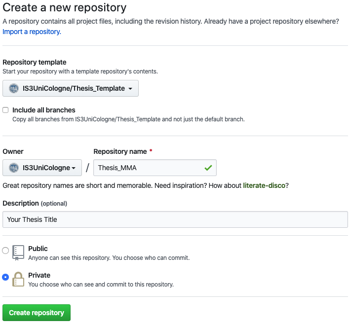
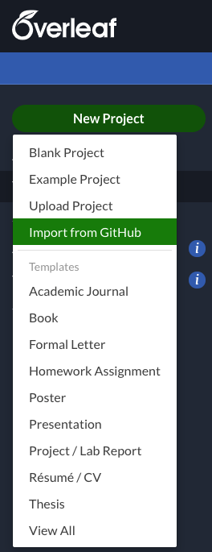
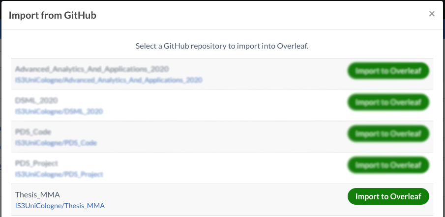

# Thesis_Template
Template for thesis repositories, incl. default structure

## Start

### Create your repository
Use this repository as template for your own thesis repository. Naming convention for your repository is `Thesis_MMA` where MMA (here for Max Mustermann) are your initials (2 letters for your surname).

### Import to Overleaf
You can import your newly created repository to Overleaf to work on your text

Now you are ready to go! 

## Stucture
The template offers a default structure of `Text/`, `Code/`, and `Docs/`. 

- Work on your text on Overleaf (you may use another tex editor, but we highly (!) recommend Overleaf)
- Develop code in the corresponding folder. Sub-directories (e.g., `Code/src/`, depending on programming language used) may be created at will.
- `Docs/` should provide a documentation of your code, i.e., all aspects of using your code that are not covered in your thesis text should be found here.
